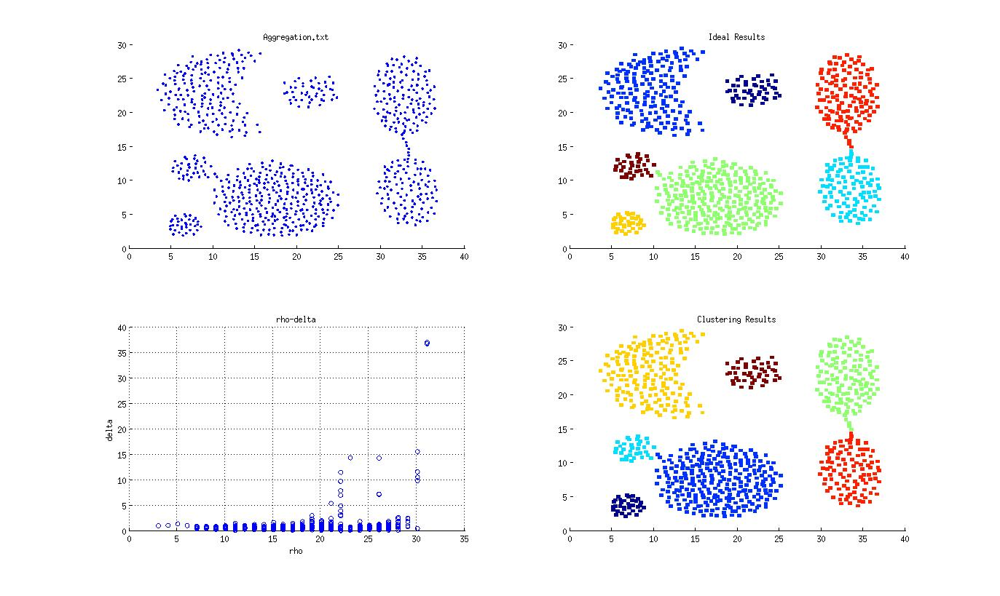
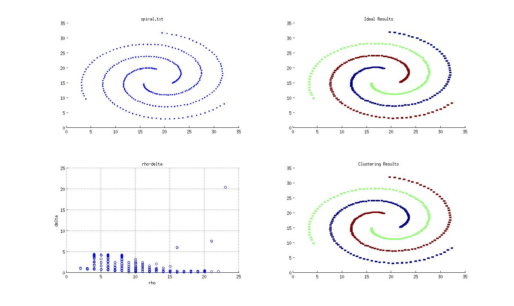
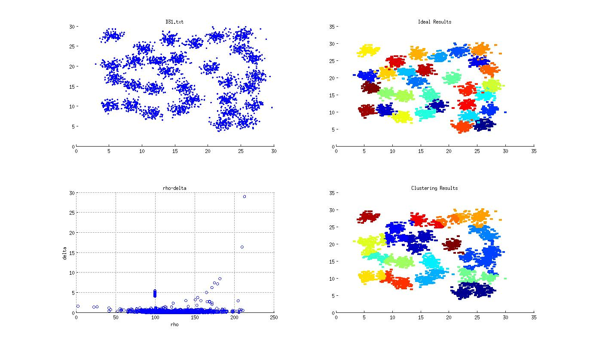

Clustering-by-fast-search-and-find-of-density-peaks
===================================================

The implementation of [Clustering by fast search and find of density peaks](http://www.sciencemag.org/content/344/6191/1492.abstract) in Scala with Akka.

When I try to implement the algorithm according to the original paper, I find the result is not so satisfied. So I 
introduce some changes in this implementation. Now it requires more care about the selection of parameters with better 
results.

## Usage

To use this implementation, you should define a class extends the ComputableItem[T <: ComputableItem[T]] trait to meet 
your needs, as follows:

``` scala
class someClass(val x: Double, val y: Double) extends ComputableItem[someClass] {

    @inline
    override def computeDistance(that: someClass): Double = ???

    @inline
    override def getString(): String = ???
  }
```

The `computeDistance(that: someClass): Double` method is defined to compute the distances/similarity between elements.

The `getString():String` method is defined to be called by `toString():String` for represent instances of someClass in 
the intermediate result.

To compute values of rho and delta:

``` scala
val fc = new FastCluster[someClass]()
val RhoDelta: List[(String, Int, Double)] = fc.computeRhoDelta(input: List[someClass], threshold: Double, flag: Boolean = false, MN: Int = Runtime.getRuntime.availableProcessors())
```

This will get the list of tuple, which contains the String representation of someClass instances, rho value and delta value.

To cluster:

``` scala
val fc = new FastCluster[myItem]()
val clusters: List[List[String]] = fc.cluster(input: List[(someClass, Int, Double)], threshold: Double, validate: (Int, Double) => Boolean)
```

This will give you a list of String list. The inner String list is the cluster of String representation of someClass 
instances. The `validate: (Int, Double) => Boolean` is the function which finds density peaks according to rho and delta.

Following are some test case results:

### Result of Aggregation



### Result of Spiral



### Result of D31

